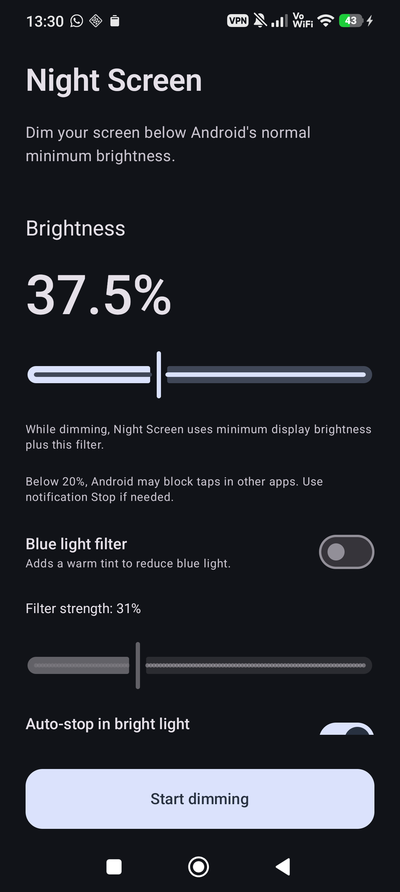

# Night Screen

Night Screen is a small Android app that dims the display below Android's
normal minimum brightness. It places one transparent black window over the
screen and keeps ordinary apps beneath it usable.



## Requirements

Android 14 or newer.

The project uses Kotlin, Jetpack Compose, minSdk 34, compileSdk 36, and
targetSdk 36.

## Permissions

### Display over other apps

This access lets Night Screen place its dimming window above other apps. The
app opens Android's own settings page and cannot grant this access itself.

### Notifications

This access is required before dimming can start. It ensures that the ongoing
foreground-service notification and its Stop action stay visible.

## Safety

The app temporarily asks Android for minimum display brightness while its
overlay is visible, then adds a software filter with
`WindowManager.LayoutParams.alpha`. It does not change Android's saved
brightness or automatic-brightness mode.

The brightness scale runs from 0.1% to 100%:

1. 0.1% uses a 99.9% black overlay.
2. 100% removes both the filter and temporary display-brightness override.
3. Fully black 0% is not offered.

The optional blue-light filter adds a warm tint. It has an on/off switch and a
saved strength from 0% to 100%.

Below about 20%, the overlay exceeds Android's usual touch-through opacity
limit. Android may then block taps in other apps. Night Screen's own controls
remain usable during preview, and the ongoing notification keeps its Stop
action as a backup exit.

The app creates one overlay window. If adding or updating that window fails,
the foreground service removes the overlay and stops. The service uses
`START_NOT_STICKY`, so dimming does not return after the app process is killed.

## Behavior

Dimming continues after the Night Screen activity is closed while its
foreground service is running.

While Night Screen itself is visible, the overlay is hidden so the controls
and Stop button remain easy to see. The overlay returns when the app moves to
the background.

While dimming is active, opening Night Screen shows a small brightness panel
over the previous screen. Slider changes update the real overlay at once. Off
stops dimming and closes the panel. Tapping outside the panel closes it and
keeps dimming active. Settings opens the full app, where brightness and
blue-light filter changes preview the overlay for 10 seconds.

Dimming stops when:

1. Stop is pressed in the app.
2. Stop is pressed in the notification.
3. Android terminates or force-stops the process.
4. An overlay update fails.

Dimming does not restart after reboot.

## Bright-light auto-stop

The optional bright-light rule stops dimming after the front light sensor
stays above the chosen level for 10 seconds. The default is 20 lux. Falling
below the level cancels the timer. The settings page shows the current reading
and lets you set the stop level from 5 to 500 lux.

The light sensor is registered only while dimming is active and this option is
enabled. It uses the sensor's on-change mode, does not poll, and does not wake
the phone. Its battery cost should be tiny.

Secure Android screens can hide application overlays. System bars, lock
screens, screenshots, and display cutouts can also differ by phone maker.

## Build and run

Connect an Android phone with USB debugging enabled, then run:

```text
./gradlew installDebug
adb shell am start -n nl.msvos.nightscreen/.MainActivity
```

Useful overlay logs:

```text
adb logcat -s NightScreen WindowManager InputDispatcher ActivityManager
```

## Privacy

Night Screen:

1. Has no internet permission.
2. Collects no analytics.
3. Stores only the chosen brightness, blue-light filter, and bright-light settings.
4. Has no accessibility service.

See [PRIVACY.md](PRIVACY.md) for the full privacy policy.

## License

Night Screen is licensed under the [GNU General Public License v3.0](LICENSE).

## Google Play release

Store text and Play Console answers are in `fastlane/metadata/android` and
`play-console`. See `play-console/release.md` for signed bundle setup and
release steps.
